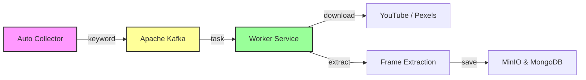

# Collector Data System

Hệ thống thu thập dữ liệu giao thông tự động hóa cao, sử dụng kiến trúc **Producer-Consumer** với **Apache Kafka** để đảm bảo hiệu năng và độ tin cậy. Dữ liệu được lưu trữ theo mô hình **Hybrid Storage** (MinIO & MongoDB).

## 🚀 Tính năng chính

1.  **Hệ thống Phân tán (Distributed System)**:
    *   **Auto Collector (Producer)**: Tự động lập lịch, quét từ khóa và gửi yêu cầu vào hàng đợi Kafka.
    *   **Worker (Consumer)**: Xử lý các tác vụ nặng (Tải video, Cắt frame) độc lập, có thể mở rộng nhiều Worker.
2.  **Thu thập dữ liệu đa nguồn**:
    *   **YouTube**: Tải video theo từ khóa hoặc URL.
    *   **Pexels**: Tải video chất lượng cao cho dataset.
    *   **Camera IP**: Thu thập ảnh realtime từ Camera stream.
3.  **Lưu trữ & Xử lý**:
    *   **Hybrid Storage**: MinIO (File Blob) + MongoDB (Metadata).
    *   **Frame Extraction**: Tự động cắt frame từ video, convert sang **16-bit PNG (1280x720)** chuẩn hóa cho AI training.

---

## 🏗 Kiến trúc Hệ thống (System Architecture)

### 1. Luồng dữ liệu (Data Flow)



### 2. Chi tiết các thành phần

| Thành phần | Công nghệ | Vai trò |
| :--- | :--- | :--- |
| **Flask API** | Python/Flask | Giao diện quản lý, API Endpoints cho Web Dashboard. |
| **Auto Collector** | APScheduler | "Nhạc trưởng", định kỳ kiểm tra Keyword và tạo Task gửi vào Kafka. |
| **Kafka** | Apache Kafka | Hàng đợi trung gian, đảm bảo không bị mất task và điều tiết lưu lượng. |
| **Worker** | Python/Consumer | "Công nhân", thực hiện việc nặng nhọc: Tải video, Cắt ảnh, Upload MinIO. |
| **MinIO** | Object Storage | Lưu trữ file vật lý: Video MP4, Ảnh PNG 16-bit. |
| **MongoDB** | NoSQL DB | Lưu trữ thông tin quản lý: Trạng thái, Đường dẫn file (MinIO Key), Metadata. |

---

## 🛠 Hướng dẫn Cài đặt & Chạy

Hệ thống chạy hoàn toàn trên Docker Container.

### 1. Cấu hình
Tạo file `.env` (nếu chưa có):
```env
# MinIO Config
MINIO_ENDPOINT=minio
MINIO_PORT=9000
MINIO_ACCESS_KEY=minioadmin
MINIO_SECRET_KEY=minioadmin123
MINIO_USE_SSL=False

# Database
DB_HOST=mongodb
DB_PORT=27017

# Kafka
KAFKA_BOOTSTRAP_SERVERS=kafka:29092

# API Key (Quan trọng)
PEXELS_API_KEY=your_pexels_api_key_here
```

### 2. Khởi chạy hệ thống
Chạy lệnh sau để build và start toàn bộ hệ thống (App, Worker, Kafka, Database):

```bash
docker compose up -d --build
```

### 3. Truy cập
*   **Web Dashboard**: [http://localhost:5000](http://localhost:5000)
*   **MinIO Console**: [http://localhost:9001](http://localhost:9001) (User/Pass: `minioadmin`/`minioadmin123`)
*   **MongoDB**: `mongodb://localhost:27018`

---

## 🔍 Hướng dẫn Debug

### Kiểm tra Worker có đang chạy không?
Để xem Worker có đang nhận việc từ Kafka và tải video không:
```bash
docker logs -f collectordata_worker
```

### Reset dữ liệu?
Nếu muốn xóa sạch database và file để chạy lại từ đầu:
```bash
docker compose down -v
```

---
*Documented by Antigravity*
