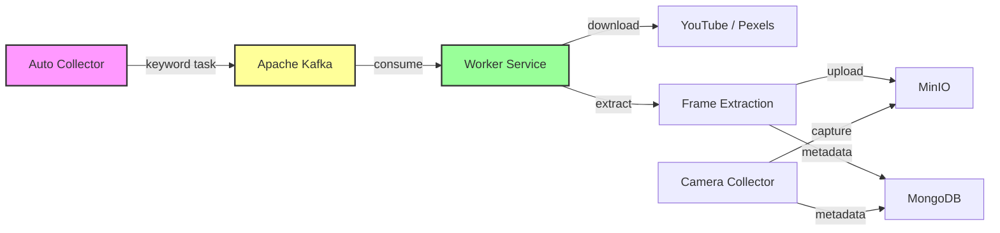

# Collector Data System

Hệ thống thu thập dữ liệu giao thông tự động hóa cao, sử dụng kiến trúc **Producer-Consumer** với **Apache Kafka** để đảm bảo hiệu năng và độ tin cậy. Dữ liệu được lưu trữ theo mô hình **Hybrid Storage** (MinIO & MongoDB).

Dự án đã được Refactor hoàn toàn sang kiến trúc **MVC Modular** để dễ dàng mở rộng và bảo trì.

## 🚀 Tính năng chính

1.  **Hệ thống Phân tán (Distributed System)**:
    *   **Auto Collector (Producer)**: Tự động lập lịch, quét từ khóa và gửi yêu cầu vào hàng đợi Kafka.
    *   **Worker (Consumer)**: Xử lý các tác vụ nặng (Tải video, Cắt frame) độc lập, có thể mở rộng nhiều Worker.
2.  **Thu thập dữ liệu đa nguồn**:
    *   **YouTube**: Tải video theo từ khóa hoặc URL.
    *   **Pexels**: Tải video chất lượng cao cho dataset.
    *   **Camera IP**: Thu thập ảnh realtime từ Camera stream.
3.  **Xử lý Nâng cao**:
    *   **Vehicle Detection**: Nhận diện phương tiện, biển số (integration with storage).
    *   **Frame Extraction**: Tự động cắt frame từ video, convert sang **16-bit PNG (1280x720)** chuẩn hóa cho AI training.
4.  **Lưu trữ Hiệu quả**:
    *   **MinIO (File Blob)**: Lưu trữ Video, Frames, Dataset, Log ảnh nhận diện.
    *   **MongoDB (Metadata)**: Quản lý metadata, trạng thái, đường dẫn.

---

## 🏗 Kiến trúc Hệ thống (System Architecture)

### 1. Luồng dữ liệu (Data Flow)



### 2. Cấu trúc Source Code (MVC)

Dự án được tổ chức gọn gàng theo mô hình Controller-Service:

```
/
├── app.py                # Main Entry Point (Registers Blueprints)
├── worker.py             # Background Worker (Kafka Consumer)
├── extensions.py         # Shared Configuration & Paths
├── controllers/          # Business Logic (Video, Dataset, Camera,...)
├── services/             # Core Logic Modules (MinIO, YT, Camera Core,...)
├── routes/               # API Definitions
├── models/               # (Planned for implementation)
├── config/               # Configuration Files (JSON, Loaders)
├── storage/              # Local Temp Storage (Mapped to Docker)
└── resources/            # Static files & Templates
    ├── static/
    └── templates/
```

### 3. Chi tiết các thành phần

| Thành phần | Công nghệ | Vai trò |
| :--- | :--- | :--- |
| **Flask API** | Python/Flask | Gateway chính, MVC Structure, cung cấp API cho Frontend. |
| **Worker** | Python/Standalone | Consumer độc lập, sử dụng `services/` để xử lý logic tải/cắt ảnh. |
| **Kafka** | Apache Kafka | Message Queue trung gian, giúp tách biệt việc "Ra lệnh" và "Thực thi". |
| **MinIO** | Object Storage | Kho lưu trữ chính thay vì ổ cứng cục bộ. |
| **MongoDB** | NoSQL DB | Database quản lý toàn bộ hệ thống. |

---

## 🛠 Hướng dẫn Cài đặt & Chạy

Hệ thống chạy hoàn toàn trên Docker Container.

### 1. Cấu hình
Đảm bảo file `.env` đã được cấu hình đúng:
```env
MINIO_ENDPOINT=minio
KAFKA_BOOTSTRAP_SERVERS=kafka:29092
PEXELS_API_KEY=your_key
...
```

### 2. Khởi chạy hệ thống
Chạy lệnh sau để build và start toàn bộ hệ thống (App, Worker, Kafka, Database, MinIO):

```bash
docker compose up -d --build
```

### 3. Truy cập
*   **Web Dashboard**: [http://localhost:5000](http://localhost:5000)
*   **MinIO Console**: [http://localhost:9001](http://localhost:9001) (User/Pass: `minioadmin`/`minioadmin123`)
*   **MongoDB**: `mongodb://localhost:27018`

---

## 🔍 Lưu ý Phát triển (Development)

*   **Logic mới**: Nếu thêm tính năng mới, hãy tạo Controller và Route tương ứng trong folder `controllers/` và `routes/`.
*   **Service**: Các logic xử lý nặng hoặc tái sử dụng nên được viết trong `services/`.
*   **Extensions**: Sử dụng `extensions.py` để lấy các biến môi trường hoặc đường dẫn chung, tránh hardcode.

---
*Documented by Antigravity*
