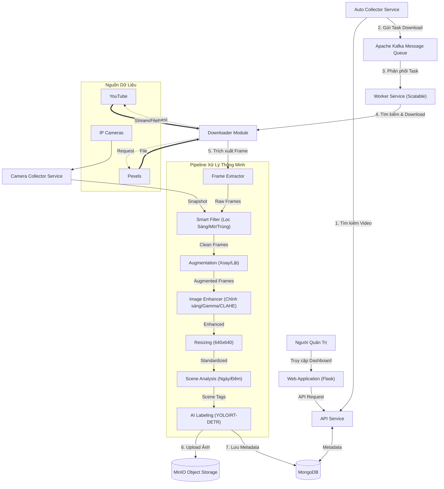

# BÁO CÁO CHI TIẾT HỆ THỐNG THU THẬP VÀ XỬ LÝ DỮ LIỆU (DATA COLLECTOR SYSTEM)

---

## 1. GIỚI THIỆU CHUNG (INTRODUCTION)

### 1.1. Bối Cảnh & Mục Tiêu
Trong kỷ nguyên số hóa và trí tuệ nhân tạo (AI), dữ liệu đóng vai trò then chốt trong việc huấn luyện các mô hình học sâu (Deep Learning). Hệ thống **Data Collector** được phát triển nhằm giải quyết bài toán tự động hóa quy trình thu thập, xử lý và lưu trữ dữ liệu hình ảnh/video quy mô lớn từ đa nguồn (Camera giám sát, Video sharing platforms).

Mục tiêu chính của hệ thống:
1.  **Tự động hóa 100%**: Giảm thiểu sự can thiệp của con người trong quy trình thu thập dữ liệu.
2.  **Đảm bảo chất lượng dữ liệu**: Tự động lọc bỏ dữ liệu nhiễu, kém chất lượng ngay từ đầu vào.
3.  **Chuẩn hóa dữ liệu**: Đồng bộ định dạng, kích thước và gán nhãn tự động (Auto-labeling) về ngữ cảnh (Ngày/Đêm/Mưa).
4.  **Lưu trữ thông minh**: Tối ưu hóa dung lượng và khả năng truy xuất phục vụ huấn luyện Model AI.

### 1.2. Phạm Vi Ứng Dụng
Hệ thống được thiết kế để phục vụ các bài toán:
*   Phát hiện phương tiện giao thông (Vehicle Detection).
*   Giám sát an ninh trật tự (Security Surveillance).
*   Phân tích hành vi đám đông (Crowd Analysis).

---

## 2. KIẾN TRÚC HỆ THỐNG (SYSTEM ARCHITECTURE)

Hệ thống được xây dựng dựa trên kiến trúc **Microservices**, vận hành hoàn toàn trên nền tảng **Containerization (Docker)** để đảm bảo tính linh hoạt, dễ dàng mở rộng và triển khai.

### 2.1. Sơ Đồ Khối Tổng Quát



### 2.2. Các Thành Phần Chi Tiết

#### A. Tầng Giao Diện & Điều Khiển (Frontend & Control Plane)
Tầng giao diện người dùng (User Interface Layer) được thiết kế là một **Single Page Application (SPA)** hiện đại, sử dụng **Alpine.js** để xử lý trạng thái (State Management) và **TailwindCSS** cho thiết kế giao diện. Đây không chỉ là nơi hiển thị thông tin mà còn là trung tâm điều phối (Orchestration Center) cho toàn bộ pipeline dữ liệu.

Các phân hệ chức năng chính bao gồm:

1.  **Dashboard Visualization (Trực quan hóa Dữ liệu & Giám sát)**:
    *   **Data Quality Assurance (DQA)**: Module kiểm toán dữ liệu tự động, hiển thị các metrics sống còn của dataset như tỷ lệ hoàn thiện metadata (File path, Duration, Resolution coverage). Giúp phát hiện sớm các dị thường trong quá trình thu thập.
    *   **Distribution Analytics**: Cung cấp cái nhìn toàn cảnh về độ cân bằng của dataset thông qua các biểu đồ:
        *   *Nền tảng*: Tỷ lệ phân bố video giữa YouTube (User-generated content) và Pexels (High-quality stock).
        *   *Scene & Weather*: Phân bố các ngữ cảnh môi trường (Ngày/Đêm/Mưa) để đảm bảo mô hình AI không bị bias.
        *   *Technical Specs*: Phân bố độ phân giải và thời lượng video.

2.  **Advanced Video Collection Strategy (Chiến lược Thu thập Video)**:
    *   **Batch Processing (Download by URL)**: Cho phép nhập liệu hàng loạt URL danh sách phát hoặc video đơn lẻ. Hệ thống tự động phân tích trang đích, trích xuất metadata và đưa vào hàng đợi xử lý tuần tự (Sequential Processing Queue).
    *   **Keyword-driven Automation**: Kích hoạt quy trình thu thập tự động dựa trên từ khóa ngữ nghĩa. Module này kết nối trực tiếp với `AutoCollectorService` để liên tục quét và tìm kiếm nội dung mới trên các nền tảng chia sẻ video, đảm bảo dataset luôn được cập nhật.

3.  **Comprehensive Data Management (Quản trị Dữ liệu)**:
    *   **Metadata Explorer**: Giao diện bảng (Grid View) cho phép truy vấn dữ liệu chi tiết. Hỗ trợ Search Full-text, Filtering đa điều kiện (theo platform, status, date) và Pagination phía Server để tối ưu hiệu năng với dataset lớn.
    *   **Labeling Progress Tracking**: Theo dõi tiến độ gán nhãn tự động (Auto-labeling) cho từng từ khóa. Tích hợp chỉ số **Labeled Frames Count** (Số lượng frame đã gán nhãn thành công) giúp người quản trị đánh giá được độ phủ của dữ liệu huấn luyện.

4.  **Real-time Traffic Camera Collector (Hệ thống Thu thập Camera Thời gian thực)**:
    *   **Geospatial Integration**: Tích hợp bản đồ số (GIS) hiển thị trực quan vị trí địa lý của các Camera Giao thông (nguồn dữ liệu từ GTVT TP.HCM).
    *   **Service Health Monitoring**: Bảng điều khiển giám sát sức khỏe của Service thu thập, hiển thị trạng thái hoạt động (Active/Inactive), Latency, và tỷ lệ lỗi (Error Rate) theo thời gian thực.
    *   **Live Stream Sampling**: Tính năng trích suất mẫu thử (Sampling) trực tiếp từ luồng video để kiểm tra chất lượng kết nối và điều kiện ánh sáng tại điểm giám sát.

5.  **Dataset Forensics & Analytics (Phân tích Dataset Chuyên sâu)**:
    *   **Statistical Analysis Tools**: Tích hợp các công cụ thống kê mô tả nâng cao:
        *   *Word Cloud*: Phân tích tần suất và xu hướng các từ khóa được quan tâm.
        *   *Scatter Plots*: Biểu đồ phân tán giúp hình dung phân bố dữ liệu trong không gian đặc trưng nhiều chiều (ví dụ: Frame Index vs. Confidence Score).
    *   **Outlier Detection (Boxplot)**: Sử dụng biểu đồ hộp để tự động phát hiện các điểm dữ liệu ngoại lai (Outliers) dựa trên các thuộc tính thống kê như độ sáng, độ mờ, kích thước file. Hỗ trợ việc làm sạch dữ liệu (Data Cleaning).

6.  **Interactive Image Processing Pipeline (Cấu hình Xử lý ảnh Tương tác)**:
    *   **Adaptive Profiles**: Cơ chế quản lý cấu hình linh hoạt cho phép định nghĩa các tham số tiền xử lý riêng biệt cho từng điều kiện môi trường (Profile Ngày, Đêm, Mưa).
    *   **A/B Testing Preview**: Tính năng so sánh song song (Side-by-side Comparison) giữa ảnh gốc và ảnh sau xử lý ngay trên trình duyệt. Cho phép tinh chỉnh thời gian thực các thuật toán Computer Vision như:
        *   *CLAHE (Contrast Limited Adaptive Histogram Equalization)*: Cân bằng Histogram thích nghi.
        *   *Gamma Correction*: Hiệu chỉnh phi tuyến độ sáng.
        *   *Gaussian/Bilateral Filtering*: Khử nhiễu bảo toàn cạnh.
    *   **Augmentation Configuration**: Thiết lập các tham số tăng cường dữ liệu (Data Augmentation) như xoay, lật, crop ngẫu nhiên để tăng độ bền vững (Robustness) cho mô hình AI.

#### B. Tầng Thu Thập Tự Động (Auto Collection Layer)
*   **Service**: `AutoCollectorService`
*   **Chức năng**:
    *   Định kỳ quét danh sách từ khóa trong Database.
    *   Tự động phát hiện các từ khóa chưa đủ dữ liệu (Số video hiện có < Mục tiêu).
    *   Tự động gửi yêu cầu thu thập (Task) vào hàng đợi Kafka.

#### C. Tầng Xử Lý Tác Vụ (Worker Layer)
*   **Công nghệ**: Apache Kafka (Message Queue) & Python Workers.
*   **Môi trường**: Docker Container với đầy đủ thư viện AI (`ultralytics`, `torch`).
*   **Chức năng**:
    *   **Decoupling**: Tách biệt việc nhận yêu cầu và xử lý thực tế, giúp hệ thống không bị quá tải khi có hàng nghìn yêu cầu cùng lúc.
    *   **Scalability**: Có thể chạy nhiều Worker container song song để tăng tốc độ xử lý.

#### D. Tầng Lưu Trữ (Storage Layer)
*   **MinIO (Object Storage)**:
    *   Đóng vai trò thay thế Amazon S3 để lưu trữ file nhị phân (Video, Hình ảnh).
    *   Cấu trúc lưu trữ phân tầng: `{Platform}/{Scene_Type}/{Video_ID}/{Filename}.png`.
*   **MongoDB (NoSQL Database)**:
    *   Lưu trữ dữ liệu phi cấu trúc và Metadata.
    *   Quản lý liên kết giữa file trên MinIO và các thông tin mô tả (Thời gian, Kích thước, Độ phân giải, Thời tiết, Trạng thái gán nhãn).

---

## 3. CHI TIẾT TÍNH NĂNG & CÔNG NGHỆ CỐT LÕI

### 3.1. Bộ Lọc Dữ Liệu Thông Minh (Smart Filtering)
Để đảm bảo chất lượng Dataset đầu ra, hệ thống áp dụng pipeline lọc đa tầng nghiêm ngặt (tại `services/video_service.py`):

1.  **Lọc Theo Độ Sáng (Brightness Filtering)**:
    *   *Nguyên lý*: Tính cường độ sáng trung bình (Mean Intensity) của ảnh.
    *   *Ngưỡng*: Loại bỏ ảnh quá tối (<40) hoặc cháy sáng (>220).
2.  **Lọc Theo Độ Mờ (Blur Detection)**:
    *   *Thuật toán*: Variance of Laplacian.
    *   *Mục đích*: Loại bỏ các frame bị nhòe do chuyển động nhanh hoặc mất nét.
3.  **Khử Trùng Lặp (Deduplication)**:
    *   *Thuật toán*: Histogram Comparison (Correlation).
    *   *Cơ chế*: So sánh biểu đồ màu của frame hiện tại với frame trước đó. Nếu độ tương đồng > 95%, hệ thống coi là trùng lặp và loại bỏ.

### 3.2. Cải Thiện & Chuẩn Hóa Ảnh (Image Enhancement)
(Module: `services/image_enhancement.py`)

Hệ thống không chỉ thu thập mà còn chủ động cải thiện chất lượng ảnh:
1.  **Phân Tích Ngữ Cảnh (Scene Analysis)**:
    *   Tự động phân loại ảnh thành **Day** (Ngày), **Night** (Đêm), hoặc **Rain** (Mưa) dựa trên đặc trưng hình ảnh.
2.  **Áp Dụng Profile Xử Lý**:
    *   Mỗi ngữ cảnh có bộ tham số (Profile) riêng biệt.
    *   *Ví dụ (Night Profile)*: Tăng Gamma (1.2) để làm sáng vùng tối, tăng Denoise (3.0) để khử nhiễu hạt.
3.  **Chuẩn Hóa Kích Thước (Resizing with Padding)**:
    *   Tất cả ảnh được đưa về kích thước chuẩn **640x640** (hoặc 1280x720 tùy cấu hình).
    *   Sử dụng kỹ thuật **Padding (Letterbox)** để giữ nguyên tỷ lệ khung hình gốc, tránh làm méo mó đối tượng trong ảnh.

### 3.3. Tự Động Gán Nhãn (Auto-Labeling Pipeline)
(Module: `services/labeling_service.py`)
*   **Mô hình tích hợp**: Hỗ trợ chạy các mô hình State-of-the-Art như **YOLOv8** và **RT-DETR**.
*   **Cơ chế**:
    *   Sau khi frame được trích xuất và xử lý, hệ thống tự động chạy inference để phát hiện đối tượng (xe cộ, người).
    *   Kết quả bounding box và class được lưu vào Database cùng với metadata của frame.
    *   Trạng thái `label_status` được cập nhật thành `labeled`.

### 3.4. Thu Thập Dữ Liệu Camera (Real-time Camera Collector)
(Module: `camera_collector.py`)
*   **Cơ chế**: Kết nối trực tiếp tới luồng dữ liệu của Camera Giao thông.
*   **Giả lập Browser**: Sử dụng Session và Cookies giả lập để vượt qua cơ chế chặn bot đơn giản.
*   **Quy trình**:
    *   Tải ảnh Snapshot thời gian thực.
    *   Sơ chế (Lọc sáng/mờ).
    *   Chuyển đổi sang định dạng `PNG 16-bit` (chất lượng cao).
    *   Upload thẳng lên MinIO và xóa file tạm để tiết kiệm ổ cứng.

---

## 4. CẤU TRÚC DỮ LIỆU (DATABASE SCHEMA)

Hệ thống sử dụng MongoDB với thiết kế Schema linh hoạt:

### 4.1. Collection `keywords` (Quản lý từ khóa)
| Field | Type | Description |
| :--- | :--- | :--- |
| `_id` | ObjectId | Khóa chính |
| `keyword` | String | Từ khóa tìm kiếm |
| `num_videos` | Int | Số lượng video mục tiêu |
| `status` | String | Trạng thái (`active`, `pending`, `completed`) |
| `total_downloaded` | Int | Số lượng đã thu thập được |
| `last_downloaded_at` | Date | Thời gian tải gần nhất |

### 4.2. Collection `video_frames` (Metadata Frame Ảnh)
| Field | Type | Description |
| :--- | :--- | :--- |
| `video_id` | String | ID video gốc |
| `video_name` | String | Tên video gốc |
| `platform` | String | Nguồn (`youtube`, `pexels`) |
| `frame_index` | Int | Vị trí frame trong video |
| `variant` | String | Biến thể (`original`, `rotate_left_15`, ...) |
| `scene_type` | String | Phân loại (`day`, `night`, `rain`) |
| `weather` | String | Thời tiết (tương tự scene_type) |
| `storage_refs` | Object | Tham chiếu MinIO (`bucket`, `key`) |
| `minio_url_path` | String | Đường dẫn MinIO truy cập nhanh |
| `file_size` | Int | Kích thước file (bytes) |
| `created_at` | Date | Thời gian tạo |
| `label_status` | String | Trạng thái gán nhãn |
| `detections` | Array | Danh sách bounding boxes (`cls`, `bbox`, `conf`) |
| `label_summary` | Object | Thống kê số lượng (ví dụ: `{"car": 5}`) |
| `winner_model` | String | Model được chọn (`yolo26` hoặc `rtdetr`) |
| `updated_at` | Date | Thời gian cập nhật |

### 4.3. Collection `downloaded_videos` (Quản lý Video gốc)
| Field | Type | Description |
| :--- | :--- | :--- |
| `video_id` | String | ID duy nhất của video |
| `title` | String | Tiêu đề video |
| `platform` | String | Nguồn (`youtube`, `pexels`) |
| `file_hash` | String | SHA256 checksum khử trùng lặp |
| `file_path` | String | Đường dẫn file (MinIO/Local) |
| `metadata` | Object | Chi tiết (`fps`, `duration`, `resolution`) |
| `storage_refs` | Object | Tham chiếu MinIO (Video + Frames) |
| `keyword` | String | Từ khóa tìm kiếm |
| `downloaded_at` | Date | Thời gian tải về |

### 4.4. Collection `camera_images` (Dữ liệu Camera GT)
| Field | Type | Description |
| :--- | :--- | :--- |
| `camera_id` | String | ID Camera |
| `camera_name` | String | Tên Camera |
| `timestamp` | Date | Thời gian chụp |
| `scene_type` | String | Phân loại cảnh (`day`, `night`, `rain`) |
| `storage_refs` | Object | Tham chiếu MinIO |
| `minio_url_path` | String | Đường dẫn MinIO |
| `file_size` | Int | Kích thước file |
| `label_status` | String | Trạng thái gán nhãn (`labeled`) |
| `detections` | Array | Danh sách bounding boxes |
| `label_summary` | Object | Thống kê số lượng |
| `winner_model` | String | Model được chọn |
| `updated_at` | Date | Thời gian cập nhật |

### 4.5. Collection `vehicle_detections` (API Event-based Detections)
*Lưu ý: Collection này lưu trữ các sự kiện nhận diện được gửi qua API (ví dụ từ thiết bị Edge hoặc upload thủ công), KHÔNG PHẢI kết quả từ quy trình gán nhãn tự động (xem `video_frames`).*
| Field | Type | Description |
| :--- | :--- | :--- |
| `event_id` | String | ID sự kiện |
| `camera_id` | String | ID Camera |
| `timestamp` | Date | Thời gian nhận diện |
| `vehicle_type` | String | Loại xe (Car/Truck/...) |
| `license_plate` | String | Biển số |
| `color` | String | Màu sắc |
| `confidence` | Float | Độ tin cậy |
| `storage_refs` | Object | Ảnh Full, Crop xe, Crop biển số |

---

## 5. HƯỚNG PHÁT TRIỂN & MỞ RỘNG (ROADMAP)

Được thiết kế theo hướng mở, hệ thống sẵn sàng cho các nâng cấp trong tương lai:

1.  **AI-based Filtering**: Thay thế thuật toán lọc CV truyền thống bằng mô hình Deep Learning (ví dụ: CNN classifier) để lọc ảnh rác chính xác hơn.
2.  **Dataset Export Service**: Module cho phép export dữ liệu đã gán nhãn sang các định dạng chuẩn (COCO, YOLO) để huấn luyện trực tiếp.
3.  **Multi-node Scaling**: Triển khai Kafka và Worker trên nhiều server vật lý khác nhau để tăng năng suất xử lý lên hàng triệu ảnh/ngày.

---

## 6. APPENDIX: CORE CODE SNIPPETS

Dưới đây là một số đoạn mã quan trọng triển khai các tính năng cốt lõi của hệ thống.

### 6.1. Smart Filtering & Deduplication
*File: `services/video_service.py`*
Thực hiện lọc độ sáng, độ mờ và khử trùng lặp dựa trên Histogram.

```python
# --- SMART FILTERING (Brightness, Blur, Deduplication) ---
# 1. Convert to gray for analysis
gray = cv2.cvtColor(resized_frame, cv2.COLOR_BGR2GRAY)

# 2. BRIGHTNESS FILTER
avg_brightness = np.mean(gray)
if avg_brightness < min_brightness or avg_brightness > max_brightness:
    count += 1
    continue

# 3. BLUR FILTER
blur_score = cv2.Laplacian(gray, cv2.CV_64F).var()
if blur_score < blur_threshold:
    count += 1
    continue

# 4. DEDUPLICATION (Histogram Similarity)
curr_hist = cv2.calcHist([resized_frame], [0, 1, 2], None, [8, 8, 8], [0, 256, 0, 256, 0, 256])
curr_hist = cv2.normalize(curr_hist, curr_hist).flatten()

if last_saved_hist is not None:
    similarity = cv2.compareHist(last_saved_hist, curr_hist, cv2.HISTCMP_CORREL)
    if similarity > sim_threshold:
        count += 1
        continue

# Apply current histogram as last saved
last_saved_hist = curr_hist
```

### 6.2. Auto-Labeling (Ensemble YOLO + RT-DETR)
*File: `services/labeling_service.py`*
Hàm gộp kết quả phát hiện từ hai mô hình để tăng độ chính xác.

```python
def _merge_detections(self, res_yolo, res_rtdetr, img_w, img_h, iou_thresh=0.45):
    """
    Ensemble YOLO26 + RT-DETR:
    - Gộp boxes hai model
    - NMS đơn giản theo confidence và IoU
    """
    boxes_yolo, conf_yolo, cls_yolo = self._extract_boxes_conf_cls(res_yolo)
    boxes_rtdetr, conf_rtdetr, cls_rtdetr = self._extract_boxes_conf_cls(res_rtdetr)

    if len(boxes_yolo) == 0 and len(boxes_rtdetr) == 0:
        merged_boxes = torch.empty((0, 4), device="cpu")
        # ... empty results
    else:
        all_boxes = torch.cat([boxes_yolo, boxes_rtdetr], dim=0)
        all_conf = torch.cat([conf_yolo, conf_rtdetr], dim=0)
        all_cls = torch.cat([cls_yolo, cls_rtdetr], dim=0)

        # NMS thủ công: sort theo conf, loại box trùng nếu IoU > iou_thresh
        _, indices = torch.sort(all_conf, descending=True)
        keep = []
        while indices.numel() > 0:
            i = indices[0].item()
            keep.append(i)
            if indices.numel() == 1:
                break
            ovr = box_iou(all_boxes[i].unsqueeze(0), all_boxes[indices[1:]])[0]
            indices = indices[1:][ovr <= iou_thresh]

        keep = torch.tensor(keep, device="cpu", dtype=torch.long)
        merged_boxes = all_boxes[keep]
        # ...
```

### 6.3. Statistics Aggregation (Labeled Counts)
*File: `services/stats_service.py`*
Tính toán thống kê số lượng frame đã gán nhãn cho từng từ khóa.

```python
# --- NEW: Aggregate LABELED frames count by video_id ---
pipeline_labeled = [
    {'$match': {'label_status': 'labeled'}},
    {'$group': {'_id': '$video_id', 'count': {'$sum': 1}}}
]
labeled_counts_map = {str(r['_id']): r['count'] for r in frames_collection.aggregate(pipeline_labeled)}

# Map to keywords
for video in videos_cursor:
    # ...
    # Get count for this video
    l_cnt = labeled_counts_map.get(vid, 0) # Labeled count
    
    # Accumulate
    if l_cnt > 0:
        keyword_labeled_counts[kw_clean] = keyword_labeled_counts.get(kw_clean, 0) + l_cnt
```

### 6.4. Frontend Display (Labeled Count Column)
*File: `static/js/main.js`*
Hiển thị cột "Frame Đã Gán Nhãn" trong bảng Top Keywords.

```javascript
// --- ADDED: Labeled Count Check ---
const labeledCount = (kw.labeled_count !== undefined && kw.labeled_count !== null) ? kw.labeled_count : 0;

return `
    <tr class="hover:bg-gray-50">
        <td class="px-6 py-4 whitespace-nowrap text-sm font-medium text-gray-900">${index + 1}</td>
        <td class="px-6 py-4 text-sm text-gray-900">${kw.keyword}</td>
        <td class="px-6 py-4 whitespace-nowrap text-sm text-gray-500">${kw.count}</td>
        <td class="px-6 py-4 whitespace-nowrap text-sm text-yellow-600 font-semibold">${labeledCount}</td>
        <!-- ... -->
    </tr>
`;
```

### 6.5. Worker Service (Kafka Consumer)
*File: `worker.py`*
Xử lý các tasks được gửi từ KafkaQueue, phân loại theo nguồn (YouTube/Pexels) để xử lý.

```python
def main():
    logger.info("Worker started...")
    consumer = get_kafka_consumer()
    
    logger.info("Waiting for messages...")
    for message in consumer:
        try:
            task = message.value
            source = task.get('source')
            keyword = task.get('keyword')
            
            logger.info(f"Received task: {source} -> {keyword}")
            
            if source == 'youtube':
                process_youtube_task(keyword)
            elif source == 'pexels':
                process_pexels_task(keyword)
            else:
                logger.warning(f"Unknown source: {source}")
                
        except Exception as e:
            logger.error(f"Error processing message: {e}")
```

### 6.6. Auto Collector Service (Task Dispatcher)
*File: `services/auto_collector_service.py`*
Định kỳ quét các keywords hoạt động và gửi task vào hàng đợi Kafka.

```python
def _loop(self):
    """Main collection loop"""
    logger.info("Auto Collector Loop Started")
    
    while self._is_running:
        try:
            # 1. Get Active Keywords
            keywords = keyword_service.get_all_keywords(active_only=True)
            
            for kw_data in keywords:
                # ...
                keyword = kw_data.get('keyword')
                logger.info(f"Dispatching task for keyword: {keyword}")
                
                # --- YOUTUBE ---
                kafka_queue.send_task('youtube', keyword)

                # --- PEXELS ---
                kafka_queue.send_task('pexels', keyword)
                
                time.sleep(1) # Rate limit dispatch
                
            # Sleep cycle
            # ...
```

### 6.7. Camera Collector (Real-time Processing)
*File: `camera_collector.py`*
Thu thập ảnh từ Camera GT, xử lý 16-bit, lọc chất lượng và upload ngay lên MinIO.

```python
def collect_image(self, camera_id: str) -> bool:
    """Download and save image -> MinIO -> MongoDB."""
    try:
        # 1. Download Image
        url = self._get_image_url(camera_id)
        response = self.session.get(url, timeout=self.REQUEST_TIMEOUT)
        
        # ... validation ...
        
        # Process image to PNG 16-bit
        img = cv2.imdecode(image_array, cv2.IMREAD_COLOR)
        
        # --- SMART FILTERING ---
        # ... deduplication check ...

        # Convert to 16-bit
        img_16bit = processed_frame.astype(np.uint16) * 256
        
        # 3. Upload to MinIO
        if should_upload_minio:
            result = minio_service.upload_and_get_key(
                file_path=file_path,
                bucket_name=minio_service.MINIO_BUCKET_FRAMES,
                custom_path=object_key,
                content_type='image/png'
            )
            
        # 4. Save Metadata
        self.save_metadata_to_db(camera_id, camera_name, file_path, minio_key, file_size, scene_type)
        
    except Exception as e:
        logger.error(f"Error collecting image for {camera_id}: {e}")
```

### 6.8. MinIO Integration (Storage Layer)
*File: `services/minio_service.py`*
Quản lý kết nối MinIO và tạo presigned URL để truy cập an toàn.

```python
def get_minio_client(internal=False):
    """Tạo MinIO client connection"""
    endpoint_host = "minio" if internal else MINIO_ENDPOINT
    endpoint = f"{endpoint_host}:{MINIO_PORT}"
    return Minio(
        endpoint,
        access_key=MINIO_ACCESS_KEY,
        secret_key=MINIO_SECRET_KEY,
        secure=MINIO_USE_SSL,
    )

def upload_and_get_key(file_path, bucket_name, content_type=None, ...):
    """Upload file lên MinIO và trả về key (path)"""
    client = get_minio_client()
    
    # ... generate object_key ...
    
    client.fput_object(
        bucket_name, object_key, file_path, content_type=content_type
    )

    return {"success": True, "bucket": bucket_name, "key": object_key}
```
